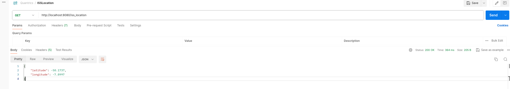
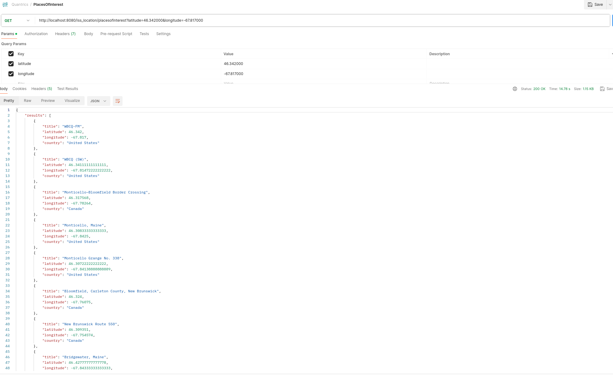

# iss-places-of-interest
Spring boot application for getting Places of Interest using International Space Station Current Location(ISS). 

### Pre-requisite
Make sure to install first the application and ensure run.sh file should be executable file.
```
mvn clean install
```
```
chmod +x scripts/run.sh  
```

### To build and run the application using Dockerfile
> **Note:** Go to root directory. Make sure that your current directory is where your Dockerfile is present.

```shell
./scripts/run.sh <your-image-name>
```


### REST APIs

|HTTP Method | URL path | Description | Sample CURL command |
|------------ | -------------| -------------| -------------| 
GET|/iss_location|Get ISS location with latitude and longitude data.| curl --location 'http://localhost:8080/iss_location'
GET|/iss_location/placesofinterest|Get places of interest base from current ISS location. It can also accepts params for latitude and longitude.| curl --location 'http://localhost:8080/iss_location/placesofinterest?latitude=46.342000&longitude=-67.817000'

### Sample using Postman GET /iss_location


### Sample using Postman GET /iss_location/placesofinterest


### Swagger documentation
- http://localhost:8080/swagger-ui/

### References:
* ISS Open-notify - http://open-notify.org/Open-Notify-API/ISS-Location-Now/
* MediaWiki - https://www.mediawiki.org/wiki/API:Main_page
* geosearh for coordinates - https://en.wikipedia.org/w/api.php?action=help&modules=query%2Bgeosearch
